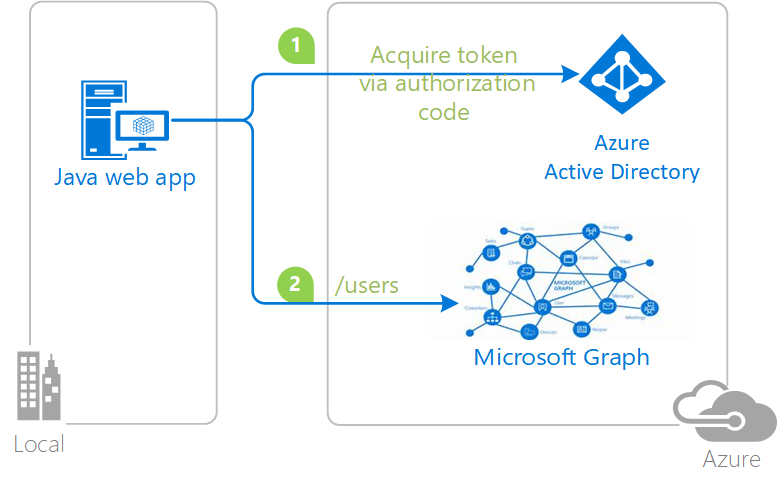

# Integrating Azure AD into a Java web application

## About this sample

### Overview

This sample demonstrates a Java web application calling a Microsoft Graph that is secured using Azure Active Directory.

1. The Java web application uses the Microsoft Authentication Library for Java (MSAL4J) to obtain a JWT access token from Azure Active Directory (Azure AD):
2. The access token is used as a bearer token to authenticate the user when calling the Microsoft Graph.




### Scenario

This sample shows how to build a Java web app that uses Oauth2 to get access to the Microsoft Graph using MSAL4J. For more information about how the protocols work in this scenario and other scenarios, see [Authentication Scenarios for Azure AD](https://docs.microsoft.com/en-us/azure/active-directory/develop/active-directory-authentication-scenarios).

## How to run this sample

To run this sample, you'll need:

- Working installation of Java and Maven
- An Internet connection
- An Azure Active Directory (Azure AD) tenant. For more information on how to get an Azure AD tenant, see [How to get an Azure AD tenant](https://azure.microsoft.com/en-us/documentation/articles/active-directory-howto-tenant/) 
- A user account in your Azure AD tenant. This sample will not work with a Microsoft account (formerly Windows Live account). Therefore, if you signed in to the [Azure portal](https://portal.azure.com) with a Microsoft account and have never created a user account in your directory before, you need to do that now.

### Step 1: Download Java (8 and above) for your platform

To successfully use this sample, you need a working installation of [Java](http://www.oracle.com/technetwork/java/javase/downloads/index.html) and [Maven](https://maven.apache.org/).

### Step 2:  Clone or download this repository

From your shell or command line:

- `git clone https://github.com/Azure-Samples/ms-identity-java-webapp.git`

### Step 3:  Register the sample with your Azure Active Directory tenant

To register these projects, you can:

- either follow the steps in the paragraphs below 
- or use PowerShell scripts that:
  - **automatically** create for you the Azure AD applications and related objects (passwords, permissions, dependencies)

If you want to use this automation, read the instructions in [App Creation Scripts](./AppCreationScripts/AppCreationScripts.md). Please note that the configuration of your code (Step 4) still needs to be done manually. 

#### First step: choose the Azure AD tenant where you want to create your applications

As a first step you'll need to:

1. Sign in to the [Azure portal](https://portal.azure.com).
1. On the top bar, click on your account, and then on **Switch Directory**. 
1. Once the *Directory + subscription* pane opens, choose the Active Directory tenant where you wish to register your application, from the *Favorites* or *All Directories* list.
1. Click on **All services** in the left-hand nav, and choose **Azure Active Directory**.

> In the next steps, you might need the tenant name (or directory name) or the tenant ID (or directory ID). These are presented in the **Properties**
of the Azure Active Directory window respectively as *Name* and *Directory ID*

#### Register the app app (Webapp-Openidconnect)

1. In the  **Azure Active Directory** pane, click on **App registrations** and choose **New registration**.
1. Enter a friendly name for the application, for example 'java-webapp', select "Accounts in any organizational directory and personal Microsoft Accounts (e.g. Skype, Xbox, Outlook.com)" 
   and select 'Web app / API' as the *Application Type*.
1. Click **Register** to register the application.
1. On the left hand menu, click on **Overview** and :
    - copy **Application (client) ID**
    - copy **Directory (tenant) ID**
    - You'll need both of these values later to configure the project, so put them in a safe place
1. On the left hand menu, click on **Authentication**, and under *Redirect URIs*, select "Web", and enter the base URL for the sample, followed by the "graph/users" By default, this sample uses `http://localhost:8000/graph/users`. Click on **save**. 
1. On the left hand menu, choose **Certificates & Secrets** and click on `New client secret` in the **Client Secrets** section:

   - Type a key description (of instance `app secret`),
   - Select a key duration of either **In 1 year**, **In 2 years**, or **Never Expires**.
   - When you save this page, the key value will be displayed, copy, and save the value in a safe location.
   - You'll need this key later to configure the project. This key value will not be displayed again, nor retrievable by any other means, so record it as soon as it is visible from the Azure portal.
1. Configure Permissions for your application. To that extent, in the left side menu, click on 'API Permissions' section and then,
   click on **Add a Permission**, then in the tab **Microsoft APIs**, lick on `Microsoft Graph`. Then, click on  **Delegated Permissions** and search for and select 
    - **User.Read.All** under **User**.
    - Click on **Add Permissions**
    - The portal will redirect you to the **API Permissions** page, where you need to click on *Grant admin consent for <Tenant>*
   - Note that for **User.Read.All** requires the user grating the
     permission to be a tenant administrator. If you created an AzureAD tenant
     as part of the sample, you will be an administrator by default. 

### Step 4:  Configure the sample to use your Azure AD tenant

Open `application.properties` in the src/main/resources folder. Fill in with your tenant and app registration information noted in registration step. Replace 'YOUR_TENANT_NAME' with the tenant id, 'YOUR_CLIENT_ID' with the Application Id and 'YOUR_CLIENT_SECRET' with the key value noted.


### Step 5: Run the application 

To run the project, you can either:

- Run it directly from your IDE by using the embedded spring boot server
- or package it to a WAR file using maven and deploy it a J2EE container solution: 

##### Running from IDE
If you running you web application from an IDE, click on run, then navigate to the home page of the project. For this sample, the standard home page URL is http://localhost:8080

##### Packaging and deploying to container

If you would like to deploy the web sample to a web container, you will need to make a couple of changes to the source code. 

1. Open msal-web-sample/pom.xml
    - Under `<name>msal-web-sample</name>` add `<packaging>war</packaging>`
    - Add dependency 
    ```
    		<dependency>
    			<groupId>org.springframework.boot</groupId>
    			<artifactId>spring-boot-starter-tomcat</artifactId>
    			<scope>provided</scope>
    		</dependency>

2. Open msal-web-sample/src/main/java/com.microsoft.azure.msalwebsample/MsalWebSampleApplication
 - Delete all source code and replace with 
 ```
 package com.microsoft.azure.msalwebsample;
    
    import org.springframework.boot.SpringApplication;
    import org.springframework.boot.autoconfigure.SpringBootApplication;
    import org.springframework.boot.builder.SpringApplicationBuilder;
    import org.springframework.boot.web.servlet.support.SpringBootServletInitializer;
    
    @SpringBootApplication
    public class MsalWebSampleApplication extends SpringBootServletInitializer {
    
    	public static void main(String[] args) {
    		SpringApplication.run(MsalWebSampleApplication.class, args);
    	}
    
    	@Override
    	protected SpringApplicationBuilder configure(SpringApplicationBuilder builder) {
    		return builder.sources(MsalWebSampleApplication.class);
    	}
    } 
```

3. Open a command prompt, go to the root folder of the project, and run `mvn package`
    - This will generate a `msal-web-sample-0.1.0.war` file in your /targets directory. 
    - Rename this file to `ROOT.war`
    - Deploy this war file using Tomcat or any other J2EE container solution. 
        - To deploy on Tomcat container, copy the .war file to the webapps folder under your Tomcat installation and then start the Tomcat server.

This WAR will automatically be hosted at `http://<yourserverhost>:<yourserverport>/`
    - Tomcats default port is 8080. This can be changed by
        - Going to tomcat/conf/server.xml
        - Search "Connector Port"
        - Replace "8080" with your desired port number

Example: `http://localhost:8080/`

### You're done!

Click on "Show users in the tenant" to start the process of logging in. Once logged in, the application will show all of the users in the tenant. 

## Community Help and Support

Use [Stack Overflow](http://stackoverflow.com/questions/tagged/adal) to get support from the community.
Ask your questions on Stack Overflow first and browse existing issues to see if someone has asked your question before.
Make sure that your questions or comments are tagged with [`msal` `Java`].

If you find a bug in the sample, please raise the issue on [GitHub Issues](https://github.com/Azure-Samples/ms-identity-java-webapp/issues).

To provide a recommendation, visit the following [User Voice page](https://feedback.azure.com/forums/169401-azure-active-directory).

## Contributing

If you'd like to contribute to this sample, see [CONTRIBUTING.MD](https://github.com/Azure-Samples/ms-identity-java-webapp/blob/master/CONTRIBUTING.md).

This project has adopted the [Microsoft Open Source Code of Conduct](https://opensource.microsoft.com/codeofconduct/). For more information, see the [Code of Conduct FAQ](https://opensource.microsoft.com/codeofconduct/faq/) or contact [opencode@microsoft.com](mailto:opencode@microsoft.com) with any additional questions or comments.

## More information

For more information, see MSAL4J [conceptual documentation](https://github.com/AzureAD/azure-activedirectory-library-for-java/wiki)

For more information about how OAuth 2.0 protocols work in this scenario and other scenarios, see [Authentication Scenarios for Azure AD](http://go.microsoft.com/fwlink/?LinkId=394414).
